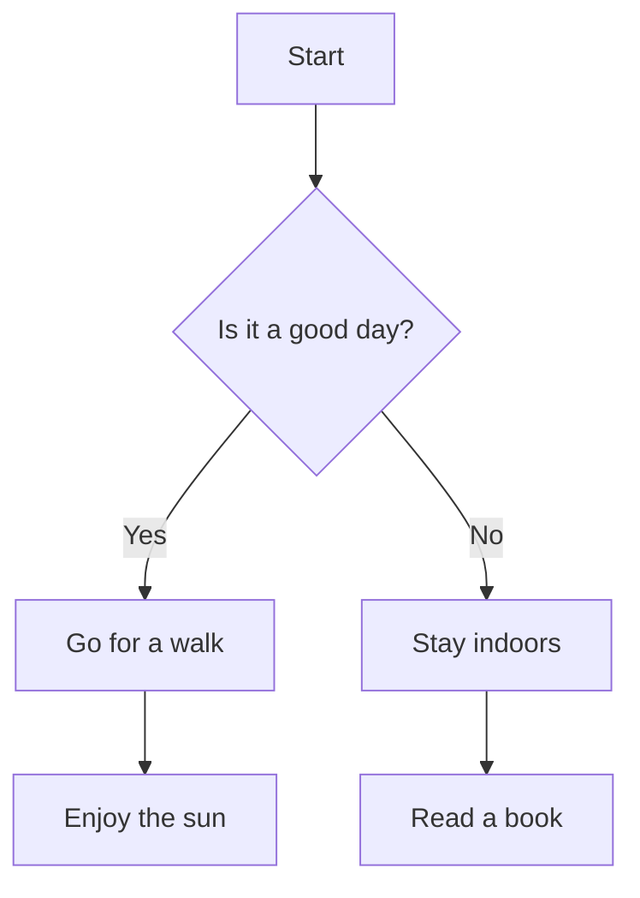
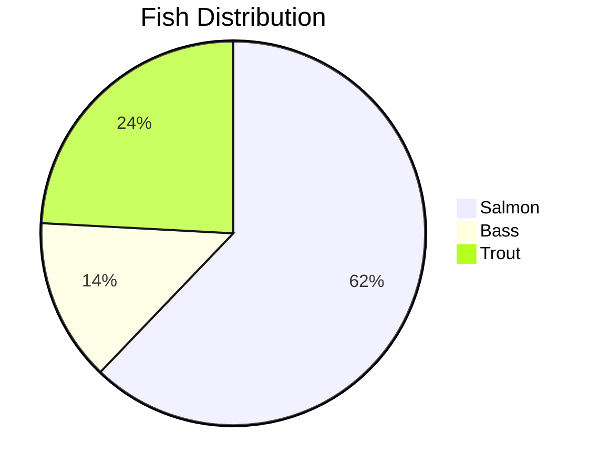

# General Testing
## Styling
- Normal text
- *Italian text*
- **Bold text**
- _Underline_
- <mark>Highlight text</mark>
- [Google Hyperlink text](https://www.google.com/)
- `single quote`

- Bullet 1
- Bullet 2
- Bullet 3

1. Number 1
2. Number 2
3. Number 3

## Table

| Header 1 | Header 2 | Header 3 |
|---|---|---|
| Row 1, Col 1 | Row 1, Col 2 | Row 1, Col 3 |
| Row 2, Col 1 | Row 2, Col 2 | Row 2, Col 3 |

## Image and Video

<!--  -->

import upAndDownURL from '/img/3sec.mp4'; // Example import

<video controls>
  <source src={upAndDownURL} />
</video>

<!-- <iframe src="https://docusaurus-junhong.s3.ap-southeast-1.amazonaws.com/5sec.mp4"></iframe> -->

## Mermaid

Sample

Sample 2

Sample 3
